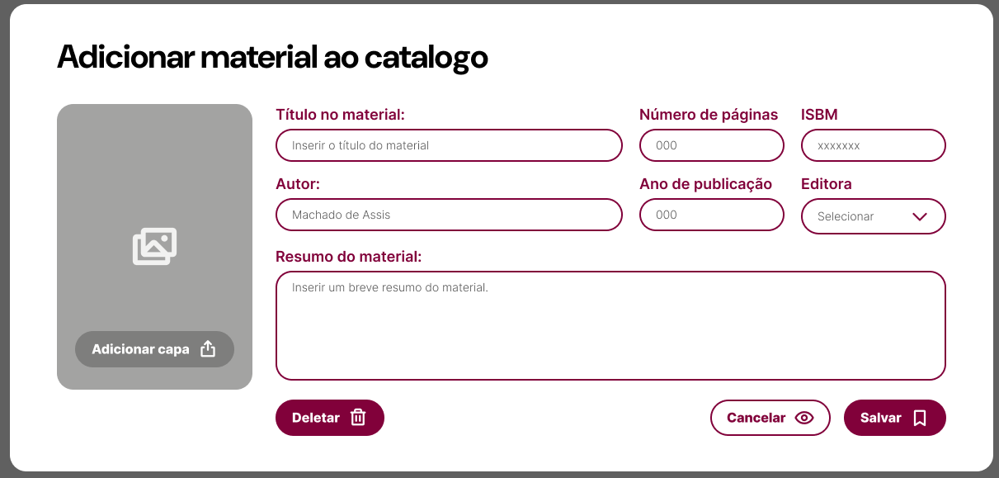
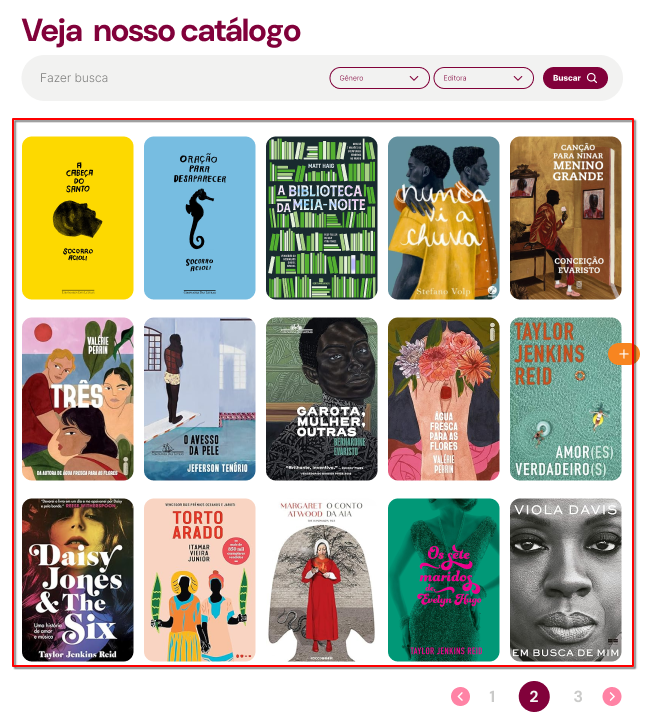

# 📚 Theka API

> **Theka API** é uma API RESTful desenvolvida com **Django REST Framework**, criada para gerenciar uma **biblioteca digital** e informações **institucionais** de forma integrada e escalável.

---

## 🌐 Acesso

- **API Base:** [LINK DA API]()
- **Documentação Interativa (Swagger):** [DOCUMENTAÇÃO DA API]()

---

## 🧰 Tecnologias Utilizadas

| Tecnologia | Descrição |
|-------------|------------|
| **Python 3.x** | Linguagem principal do projeto |
| **Django 4.x** | Framework backend robusto e escalável |
| **Django REST Framework** | Criação e gerenciamento de APIs RESTful |

---

## 🏗️ Estrutura e Organização

A aplicação é composta por dois módulos principais:

### **📖 Biblioteca**
Gerencia os dados literários da aplicação:
- **Livro** — Informações completas sobre cada obra.
- **Editora** — Dados das editoras registradas.
- **Gênero** — Classificação literária dos livros.

### **🏢 Institucional**
Gerencia as informações institucionais:
- **SobreNós** — Descrição da empresa e banner.
- **NossaHistória** — Histórico institucional com imagem ilustrativa.
- **MembrosEquipe** — Cadastro de membros da equipe.
- **NossosValores** — Valores e princípios corporativos.
- **Tópicos** — Tópicos de apresentação institucional.
- **EstatísticasBiblioteca** — Atualização automática de métricas.

---

## 🧩 Correspondência entre Endpoints e Mockups

### 📋 Tabela de Referência

| Tela / Componente | Imagem | Descrição | Endpoint da API | Método HTTP |
|------------------|--------|-----------|-----------------|-------------|
| 📚 **Tela Biblioteca** |  | Lista todos os livros disponíveis com título, autor e gênero | `/api/livros/` | GET |
| 📘 **Detalhes do Livro** |  | Exibe informações detalhadas de um livro selecionado | `/api/livros/{id}/` | GET |
| ➕ **Adicionar Livro** |  | Formulário para cadastrar novo livro | `/api/livros/` | POST |
| ✏️ **Editar Livro** |  | Formulário para editar informações de um livro existente | `/api/livros/{id}/` | PUT/PATCH |
| 🗑️ **Excluir Livro** |  | Remove um livro do sistema | `/api/livros/{id}/` | DELETE |
| 🏢 **Página "Sobre Nós"** |  | Mostra banner e descrição institucional | `/api/sobrenos/` | GET |
| 📜 **Página "Nossa História"** |  | Exibe a história da empresa e imagem ilustrativa | `/api/nossa-historia/` | GET |
| 👥 **Seção Equipe** |  | Lista todos os membros da equipe com nome, cargo e foto | `/api/membros-equipe/` | GET |
| 💡 **Seção Nossos Valores** |  | Exibe valores institucionais e descrições | `/api/nossos-valores/` | GET |
| 📊 **Dashboard Estatísticas** |  | Mostra números automáticos de livros, autores e usuários | `/api/estatisticas/` | GET |
| 🧱 **Página de Administração** |  | Permite criar, editar e excluir registros institucionais | `/api/<entidade>/` | POST, PUT, PATCH, DELETE |
| **Seção de contatos (footer)** |  | dados do Footer | `institucional/` | GET, POST |
| **Catalogo dos livros** |  | Catalogo dos livros | `institucional/` | GET |

---

## 🔍 Filtros e Buscas - API Theka

### 📋 Filtros Disponíveis

A API Theka oferece diversos filtros para facilitar a busca e organização dos livros. Abaixo estão os filtros disponíveis e como utilizá-los:

#### 🎯 Filtros Básicos

| Parâmetro | Tipo | Descrição | Exemplo |
|-----------|------|-----------|----------|
| `genero` | ID | Filtra por gênero específico | `?genero=1` |
| `editora` | ID | Filtra por editora específica | `?editora=2` |
| `ano_publicacao` | Integer | Filtra por ano de publicação | `?ano_publicacao=2023` |

#### 🔍 Busca por Texto

| Parâmetro | Descrição | Campos Pesquisados | Exemplo |
|-----------|-----------|-------------------|----------|
| `search` | Busca textual | título, autor, ISBN | `?search=dom+casmurro` |

#### 📊 Ordenação

| Parâmetro | Descrição | Campos Disponíveis | Exemplo |
|-----------|-----------|-------------------|----------|
| `ordering` | Ordena os resultados | `titulo`, `autor`, `ano_publicacao`, `criado_em` | `?ordering=titulo` |

#### 📄 Paginação

| Parâmetro | Descrição | Exemplo |
|-----------|-----------|----------|
| `page` | Número da página | `?page=2` |
| `page_size` | Itens por página | `?page_size=20` |

---

## 🔐 Autenticação e Permissões

A API está atualmente configurada para acesso privado, com suporte à autenticação via **token JWT**. Dessa forma, o acesso aos endpoints é **restrito exclusivamente a usuários autenticados**

tudo de autenticação será feito usando os endpoints de `users` e `auth`

---

## 🧱 Estrutura do Projeto

```
theka_API/
├── institucional/                      # App institucional
│ ├── models.py
│ ├── serializers.py
│ ├── views.py
│ ├── urls.py
│ ├── admin.py
│ ├── apps.py
│ ├── migrations/
│ └── tests/
│ ├── test_models.py
│ └── test_views.py
├── library/                             # App da biblioteca
│ ├── models.py
│ ├── serializers.py
│ ├── views.py
│ ├── urls.py
│ ├── admin.py
│ ├── apps.py
│ ├── filters.py
│ ├── pagination.py
│ ├── utils.py
│ ├── migrations/
│ └── tests/
│ ├── test_models.py
│ └── test_views.py
├── users/                                # App de usuários
│ ├── models.py
│ ├── serializers.py
│ ├── views.py
│ ├── urls.py
│ ├── admin.py
│ ├── apps.py
│ ├── migrations/
│ └── tests/
├── theka/                                 # Configurações do projeto
│ ├── init.py
│ ├── settings.py
│ ├── urls.py
│ ├── asgi.py
│ └── wsgi.py
├── manage.py
├── requirements.txt
├── db.sqlite3
└── README.md
```

---

## 🧑‍💻 Autor

**Carlos Gabriel**  
Desenvolvedor Backend | Estudante de Engenharia da Computação  
[GitHub](https://github.com/) • [LinkedIn](https://linkedin.com/)
