# 📚 Theka API

> **Theka API** é uma API RESTful desenvolvida com **Django REST Framework**, criada para gerenciar uma **biblioteca digital** e informações **institucionais** de forma integrada e escalável.

---

## 🌐 Acesso

- **API Base:** [LINK DA API](https://thekaapideploy2.pythonanywhere.com)
- **Documentação Interativa (Swagger):** [DOCUMENTAÇÃO DA API](https://thekaapideploy2.pythonanywhere.com/docs/)

---

## 🧰 Tecnologias Utilizadas

| Tecnologia | Descrição |
|-------------|------------|
| **Python 3.13.5** | Linguagem principal do projeto |
| **Django 5.2.7** | Framework backend robusto e escalável |
| **Django REST Framework 3.16.1** | Criação e gerenciamento de APIs RESTful |

---

## 🏗️ Estrutura e Organização

A aplicação é composta por dois módulos principais:

### **📖 Biblioteca**
Gerencia os dados literários da aplicação:
- **Livro** — Informações completas sobre cada obra.
- **Editora** — Dados das editoras registradas.
- **Gênero** — Classificação literária dos livros.

### **🏢 Institucional**
Gerencia as informações institucionais:
- **SobreNós** — Descrição da empresa e banner.
- **NossaHistória** — Histórico institucional com imagem ilustrativa.
- **MembrosEquipe** — Cadastro de membros da equipe.
- **NossosValores** — Valores e princípios corporativos.
- **Tópicos** — Tópicos de apresentação institucional.
- **EstatísticasBiblioteca** — Atualização automática de métricas.

---

## 🧩 Correspondência entre Endpoints e Mockups

### 📋 Tabela de Referência - Login, cadastro e recuperar senha

| Tela / Componente | Imagem | Descrição | Endpoint da API | Método HTTP |
|------------------|--------|-----------|-----------------|-------------|
| **Recuperar senha (etapa 1)** | 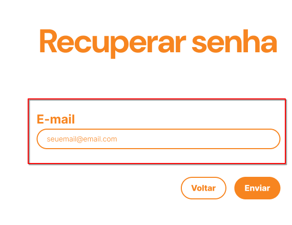 | Envia o e-mail de redefinição de senha para o usuário que esqueceu a senha. | `/auth/password/reset/` | POST |
| **Recuperar senha (etapa 2)** | 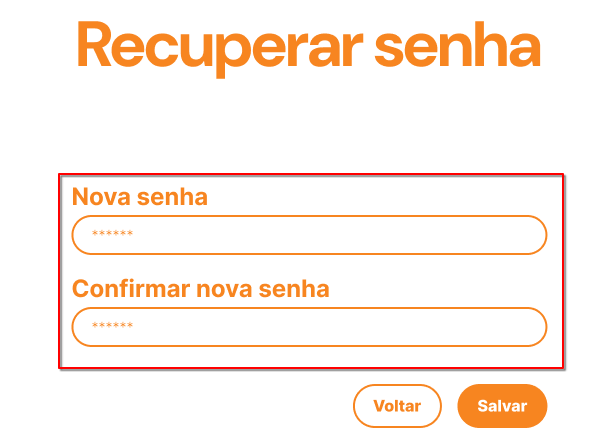 | Confirma a redefinição da senha usando o token enviado por e-mail e define a nova senha. | `/auth/password/reset/confirm/` | POST |
| **Login (obter token JWT)** | 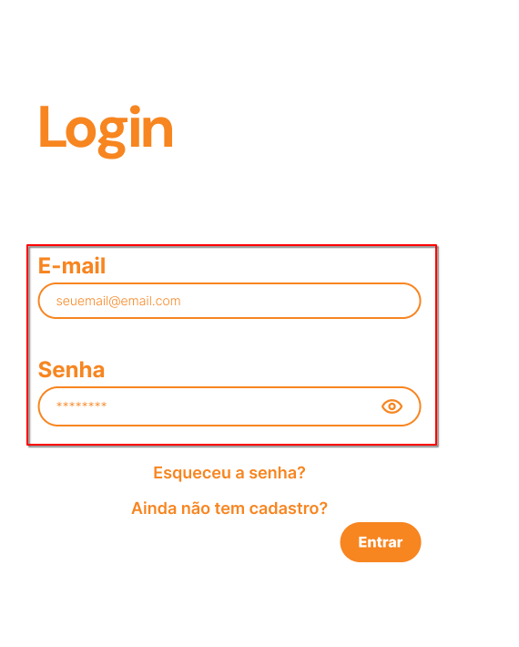 | Realiza o login do usuário e retorna o token de acesso (JWT). | `/auth/token/` | POST |
| **Criar usuário** | 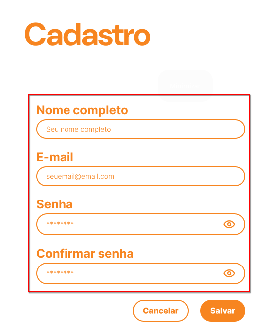 | Cria um novo usuário no sistema. | `/users/` | POST |

### 📋 Tabela de Referência - Inicio

| Tela / Componente | Imagem | Descrição | Endpoint da API | Método HTTP |
|------------------|--------|-----------|-----------------|-------------|
| **Nossas estatisticas** | 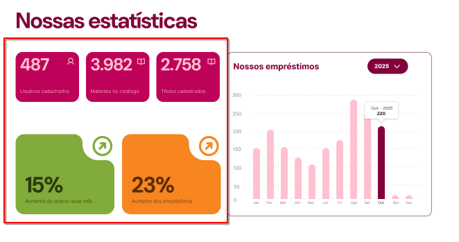 | Dados das estatisticas do site | `/institucional/estatisticas-biblioteca/` | GET |
| **Seção de contatos (footer)** |  | Dados do Footer | `/institucional/contato/` | GET, POST |

### 📋 Tabela de Referência - Acervo

| Tela / Componente | Imagem | Descrição | Endpoint da API | Método HTTP |
|------------------|--------|-----------|-----------------|-------------|
| **Novidades da Semana** | 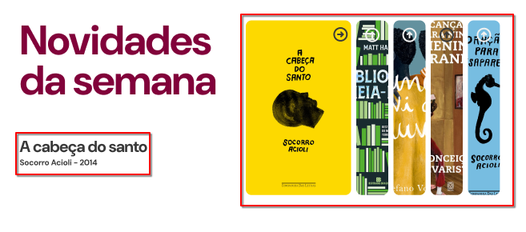 | Livros mais recentes | `/livros/novidades/` | GET |
| **Catalogo dos livros** | 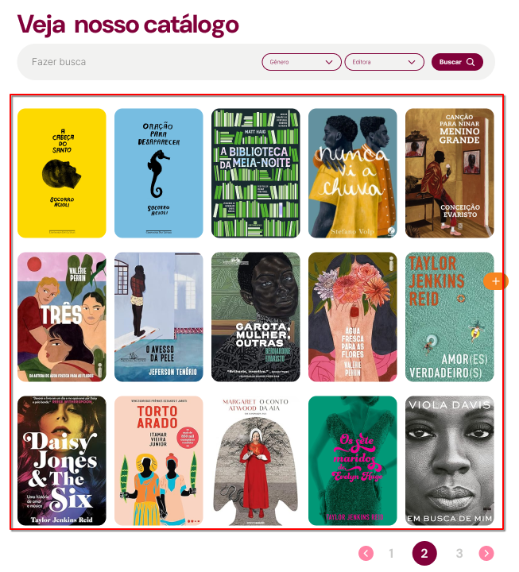         | Catalogo dos livros                  | `/livros/` | GET |
| **Adicionar Livro**  | 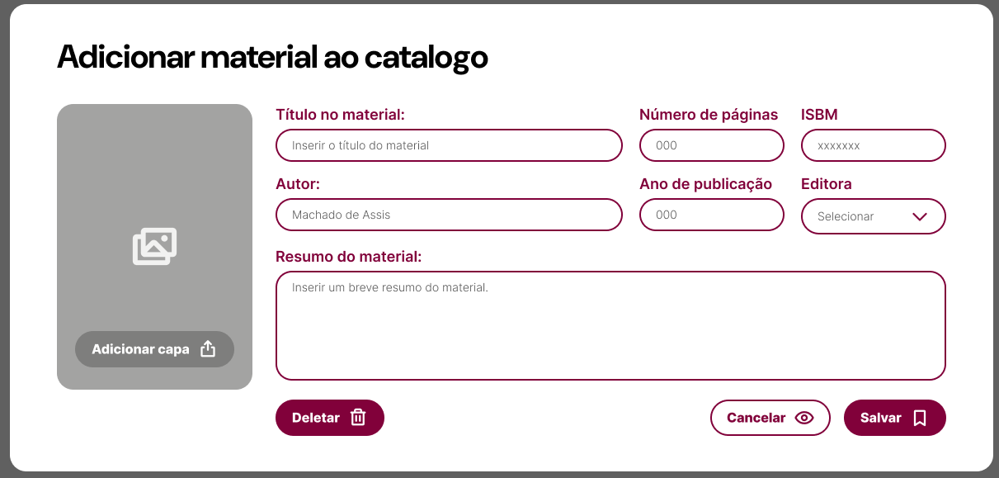 | Formulário para cadastrar novo livro | `/livros/`   | POST |
| **Editar Livro**  | 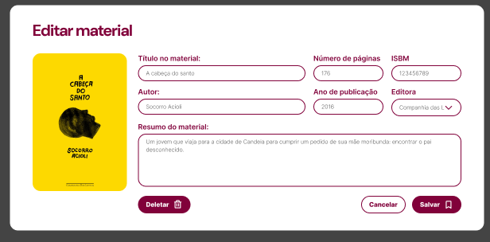 | Formulário para editar um livro | `/livros/{id}/`   | PATCH |
| **Ver mais (Livro)**  | 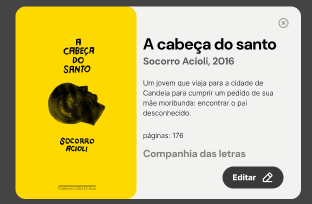 | ver detalhes do livro | `/livros/{id}/`   | GET |
| **Seção de contatos (footer)** |  | Dados do Footer | `/institucional/contato/` | GET, POST |

### 📋 Tabela de Referência - Sobre Nós

| Tela / Componente | Imagem | Descrição | Endpoint da API | Método HTTP |
|------------------|--------|-----------|-----------------|-------------|
| **Banner inicial** | 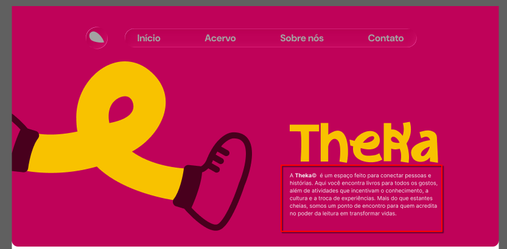 | texto do banner inicial | `/institucional/sobrenos/` | GET, POST |
| **Topicos** |  | Topicos de exibição | `/institucional/topicos/` | GET, POST |
| **Nossa Historia** | 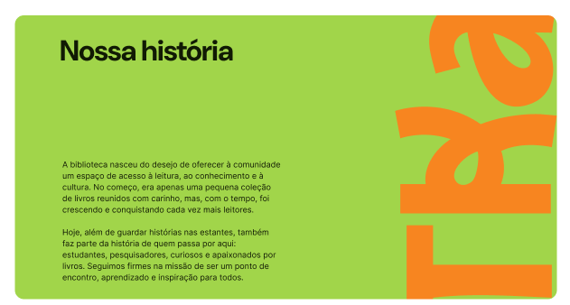 | Nossa historia | `/institucional/institucional/nossa-historia/` | GET, POST |
| **Nossos valores** | 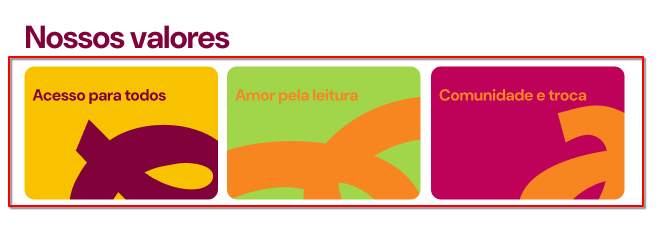 | Criar e obter nossos valores | `/institucional/nossos-valores/` | GET, POST |
| **Nossa equipe** |  | criar e obter novos membros da equipe | `/institucional/membros-equipe/` | GET, POST |

---

## 🔍 Filtros e Buscas - API Theka

### 📋 Filtros Disponíveis

A API Theka oferece diversos filtros para facilitar a busca e organização dos livros. Abaixo estão os filtros disponíveis e como utilizá-los:

#### 🎯 Filtros Básicos

| Parâmetro | Tipo | Descrição | Exemplo |
|-----------|------|-----------|----------|
| `genero` | ID, nome | Filtra por gênero específico | `?genero=1` `?genero_nome=comedia` |
| `editora` | ID, nome | Filtra por editora específica | `?editora=2` `?editora_nome=intrinseca` |
| `ano_publicacao` | Integer | Filtra por ano de publicação | `?ano_publicacao=2023` |

#### 🔍 Busca por Texto

| Parâmetro | Descrição | Campos Pesquisados | Exemplo |
|-----------|-----------|-------------------|----------|
| `search` | Busca textual | título, autor, ISBN | `?search=dom+casmurro` |

#### 📊 Ordenação

| Parâmetro | Descrição | Campos Disponíveis | Exemplo |
|-----------|-----------|-------------------|----------|
| `ordering` | Ordena os resultados | `titulo`, `autor`, `ano_publicacao`, `criado_em` | `?ordering=titulo` |

#### 📄 Paginação

| Parâmetro | Descrição | Exemplo |
|-----------|-----------|----------|
| `page` | Número da página | `?page=2` |
| `page_size` | Itens por página | `?page_size=20` |

---

## 🔐 Autenticação e Permissões


Atualmente, todos os endpoints da API estão **livres para acesso público**, ou seja, **não exigem autenticação** para realizar requisições.  

No entanto, a estrutura da aplicação já está preparada para suportar autenticação e controle de acesso. É possível ativar a proteção dos endpoints utilizando os recursos disponíveis em:

- **Endpoints de autenticação (`/auth/`)** — responsáveis por login, recuperação e atualização de tokens JWT.  
- **Endpoints de usuários (`/users/`)** — permitem gerenciar contas e definir permissões específicas para cada usuário.

Dessa forma, caso seja necessário restringir o acesso futuramente, basta configurar as permissões e aplicar autenticação via **token JWT** (JSON Web Token) nos endpoints desejados.

---

## 🧱 Estrutura do Projeto

```
theka_API/
├── institucional/                      # App institucional
│ ├── models.py
│ ├── serializers.py
│ ├── views.py
│ ├── urls.py
│ ├── admin.py
│ ├── apps.py
│ ├── migrations/
│ └── tests/
│ ├── test_models.py
│ └── test_views.py
├── library/                            # App da biblioteca
│ ├── models.py
│ ├── serializers.py
│ ├── views.py
│ ├── urls.py
│ ├── admin.py
│ ├── apps.py
│ ├── filters.py
│ ├── pagination.py
│ ├── utils.py
│ ├── migrations/
│ └── tests/
│ ├── test_models.py
│ └── test_views.py
├── users/                              # App de usuários
│ ├── models.py
│ ├── serializers.py
│ ├── views.py
│ ├── urls.py
│ ├── admin.py
│ ├── apps.py
│ ├── migrations/
│ └── tests/
├── theka/                              # Configurações do projeto
│ ├── init.py
│ ├── settings.py
│ ├── urls.py
│ ├── asgi.py
│ └── wsgi.py
├── manage.py
├── requirements.txt
├── db.sqlite3
└── README.md
```

---

## 🧑‍💻 Autor

**Carlos Gabriel**  
Desenvolvedor Backend | Estudante de Engenharia da Computação  
[GitHub](https://github.com/CarlosG18) • [LinkedIn](https://linkedin.com/in/carlosg18/)
